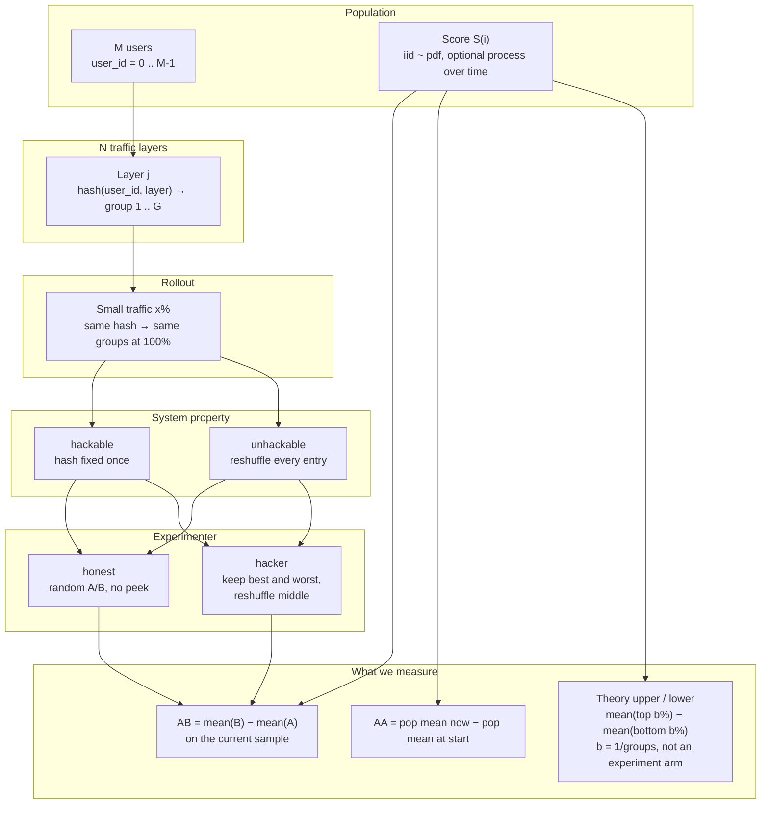

# abhack

`src` defines users, layer hashing, and scoring from a distribution. `exp` wires those steps into experiments.

User `i` is the stable integer `user_id`. On a layer, the bucket depends only on `user_id` and the layer name, so the same user stays in the same bucket if you hash again or if you hash a subset and then the full list. A score has a column name you choose. It is drawn independently from a distribution and does not look at the bucket.

## System diagram



Reading order: population and score on the left; each developer owns a layer with a fixed hash; traffic can grow from x% to 100%. The **system** decides whether that hash sticks. The **agent** decides whether A/B is random or a peeking hack. Theory upper/lower are the score selection ceiling (top b% vs bottom b%), not a fifth experiment arm.

## One-command setup

From the repository root:

```bash
chmod +x setup
./setup
```

That creates `.venv`, installs `abhack` into it, and runs the example configs under `exp/runs/`. Outputs land in `exp/out/<name>/`.

Run a subset:

```bash
./setup hack ar1
./setup demo scores_mix
```

Later sessions:

```bash
source .venv/bin/activate
python exp/study.py exp/runs/hack.toml
```

Requires Python 3.10+. Dependencies are numpy and scipy (declared in `pyproject.toml`).

Manual install without the script:

```bash
python3 -m venv .venv
source .venv/bin/activate
pip install -e .
```

## Layout

```
src/abhack/
  users/          write and read user_id
  layer/          write the hash to CSV and check buckets
  metric/         draw scores and check them
  utils/hash.py           hash
  utils/distributions.py  distributions
  evaluate/       AB gain, AA gain, group bounds
  strategies/     sticky hash, fresh splits, honest arm, keep-extremes
  process/        static, redraw, and AR(1) scores
  study/          system x agent comparison
exp/run.py        generate users, buckets, and scores from one file
exp/study.py      run the 2x2 study
exp/runs/         example experiment configs
exp/out/          default output directory
setup             create .venv, install, run examples
```

## System x agent

Two axes, and they multiply.

| | **honest** (random A/B, no peeking) | **hacker** (keep best & worst, reshuffle middle) |
| --- | --- | --- |
| **hackable** (sticky layer hash) | baseline on a sticky system | AB claim that can survive traffic rollout |
| **unhackable** (reshuffle every entry) | baseline on a fresh split | AB claim that does not carry to the next entry |

**Theory upper / lower are not experiments.** They are the selection ceiling on the current sample:

- upper = mean(top b% by score) − mean(bottom b% by score)
- lower = the reverse
- b = 1 / groups (five groups → 20%)

Any AB that puts about b% of users in B and about b% in A sits at or below the upper. Honest and hacker share this ceiling; only their AB numbers differ. The system decides whether a sticky hash can keep a high claim when traffic goes to 100%.

AB gain is mean(B) − mean(A) on the current sample. AA gain is the population mean now minus the population mean at the start. Scores stay iid from the distribution in the file unless a process moves them: `static`, `redraw`, or `ar1` (`phi`, `shock`).

## Worked example: `hack.toml`

Config:

```toml
name = "hack"
users = 20000
rounds = 24
seed = 0
traffic = 0.1
layer = "layer0"
groups = 5

[score]
dist = "normal"
mu = 0
sigma = 1

[process]
kind = "static"
```

Meaning: 20k users, scores frozen from N(0,1), 10% small traffic, five groups of ~20%, 24 rounds. Same score path for all four cells.

```bash
python exp/study.py exp/runs/hack.toml
```

What to look for in the terminal / `exp/out/hack/study.csv`:

1. **AA stays 0** — process is `static`, so the population mean does not move.
2. **hackable × honest** — AB wanders near 0; theory upper is the top-b% vs bottom-b% ceiling.
3. **hackable × hacker** — sample AB climbs but stays ≤ theory upper; `ab_full` is the same labels on 100% traffic.
4. **unhackable × honest** — still near 0; same theory ceiling while scores are static.
5. **unhackable × hacker** — sample AB can look large that round (still ≤ upper), but the next entry redraws groups.

## Example experiments

| file | what it shows |
| --- | --- |
| `exp/runs/demo.toml` | generate users, hash, several scores |
| `exp/runs/scores_mix.toml` | more score families on one user list |
| `exp/runs/hack.toml` | 2x2 study, static normal, 10% traffic |
| `exp/runs/sticky_small.toml` | sticky scores, small traffic |
| `exp/runs/sticky_full.toml` | sticky scores, 100% traffic |
| `exp/runs/redraw.toml` | iid redraw each round |
| `exp/runs/ar1.toml` | mean-reverting process |
| `exp/runs/click.toml` | bernoulli clicks, redraw, 5% traffic |

```bash
python exp/run.py exp/runs/demo.toml
python exp/run.py exp/runs/scores_mix.toml
python exp/study.py exp/runs/hack.toml
python exp/study.py exp/runs/ar1.toml -M 10000 --traffic 0.1
```

`-M` / `--traffic` / `--rounds` / `--seed` override the file. The file `seed` is the default; pass `--seed 7` for another draw. Study rows go to `exp/out/<name>/study.csv` with columns `system`, `agent`, `ab`, `ab_full`, `aa`, `upper`, `lower`.

## Call the pieces

```python
from abhack.users import generate_users, write_csv, read_csv
from abhack.utils.hash import hash_buckets
from abhack.layer import write_assignment, check_assignment_file
from abhack.utils.distributions import normal
from abhack.metric import write_metric, check_metric_file

ids = generate_users(100)
write_csv(ids, "exp/out/users.csv")
hash_buckets(ids[:8], n_buckets=2, layer="layer0")
write_assignment("exp/out/users.csv", "exp/out/layer0.csv", "layer0", 2)
score = normal(mu=0.0, sigma=1.0)
write_metric("exp/out/users.csv", "exp/out/ctr.csv", "ctr", score, seed=0)
check_metric_file("exp/out/ctr.csv", score, seed=0, name="ctr")
```

```bash
python -m abhack.users -M 100000 -o exp/out/users.csv
python -m abhack.layer -i exp/out/users.csv -o exp/out/layer0.csv --layer layer0 -k 2
python -m abhack.metric -i exp/out/users.csv -o exp/out/ctr.csv \
    --name ctr --dist normal --mu 0 --sigma 1 --seed 0
```

`--dist` is `normal`, `uniform`, `exponential`, or `bernoulli`. `python -m abhack...` needs the editable install from `./setup` or `pip install -e .`.
